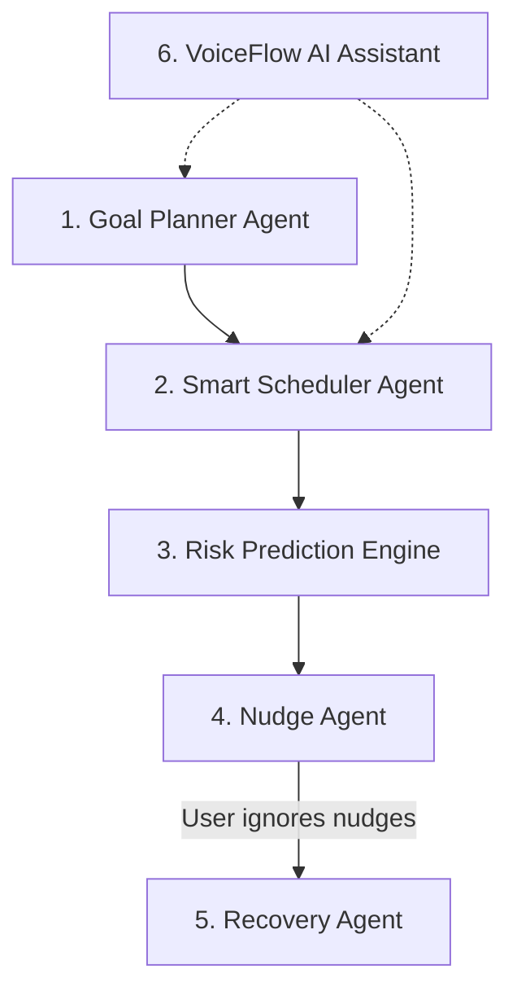

<div align="center">

# FocusFlow AI
*Your AI-powered execution partner that helps you finish what you start.*

[](https://nextjs.org/)
[](https://fastapi.tiangolo.com/)
[](https://www.python.org/)
[](https://www.typescriptlang.org/)
[](https://tailwindcss.com/)
[](https://firebase.google.com/)
[](https://cloud.google.com/)
[](https://ai.google.dev/)
[](https://opensource.org/licenses/MIT)

<br/>

[](https://vibe2ship.com)
[](https://ai.google.dev/)
[](https://cloud.google.com/run)
[](http://makeapullrequest.com)

</div>

## 🎥 DEMO


Live Demo: [FocusFlow AI](YOUR_CLOUD_RUN_URL)

---

## 📑 TABLE OF CONTENTS
- [OVERVIEW](#-overview)
- [FEATURES](#-features)
- [AGENT ARCHITECTURE](#-agent-architecture)
- [TECH STACK](#-tech-stack)
- [GOOGLE TECHNOLOGIES](#-google-technologies)
- [PROJECT STRUCTURE](#-project-structure)
- [GETTING STARTED](#-getting-started)
- [DEPLOYMENT](#-deployment-google-cloud-run)
- [ENVIRONMENT VARIABLES](#-environment-variables)
- [HOW IT WORKS](#-how-it-works)
- [SCREENSHOTS](#-screenshots)
- [CONTRIBUTING](#-contributing)
- [LICENSE](#-license)
- [TEAM](#-team)
- [ACKNOWLEDGEMENTS](#-acknowledgements)

---

## 📖 OVERVIEW

FocusFlow AI is an intelligent multi-agent productivity coach designed to solve "The Last-Minute Life Saver" problem statement. Traditional to-do apps leave the heavy lifting of planning and scheduling entirely to the user, leading to overwhelm and procrastination. FocusFlow AI leverages a swarm of six specialized AI agents that autonomously break down your goals, schedule them strictly around your availability, nudge you proactively, and continuously recalibrate when you fall behind. 

*People don't fail because they don't know what to do — they fail because they struggle with execution.*

---

## ✨ FEATURES

### 🤖 AI Agents
- **AI Goal Decomposition**: Transforms a single, abstract sentence into a comprehensive, prioritized list of actionable tasks with accurate time estimates.
- **Transparent AI Generation**: Watch the AI agents' reasoning steps live in the UI as they orchestrate your execution plan.

### 📅 Scheduling
- **Personalized Working Windows**: Strictly restricts task scheduling to your exact available hours (Morning, Afternoon, Evening, Night, or Custom slots).
- **Google Calendar Sync**: Seamlessly push your generated, conflict-free AI schedules directly into your Google Calendar with one click.

### 🔔 Smart Nudging
- **Context-Aware Nudges**: Intelligent push notifications generated dynamically by Gemini based on your calendar availability, task urgency, and behavioral history (no generic reminders).
- **Three Adaptive Modes**: Choose between *Focus*, *Coach*, or *Accountability* modes to dictate how strictly the AI nudges you.

### 📊 Risk & Recovery
- **Real-Time Deadline Risk Prediction**: A continuous classification engine that rates your goals as Low, Medium, High, or Critical risk based on your progress velocity.
- **Automatic Recovery Planning**: When you miss deadlines or fall behind, the system automatically reprioritizes your tasks and builds a brand new recovery execution schedule.

### 🎙️ Voice & 🔗 Integrations
- **VoiceFlow AI Assistant**: Complete hands-free interactions allowing you to create goals, check your daily schedule, and mark tasks as complete using only your voice.
- **Firebase Authentication & Firestore**: Secure, isolated cloud storage for each user's data with seamless Google OAuth login.

---

## 🧠 AGENT ARCHITECTURE

The core of FocusFlow AI is a sequential, multi-agent orchestration pipeline.



**1. Goal Planner Agent**  
*Breaks down high-level user goals into granular, estimated tasks.*  
*Leverages Gemini Function Calling to guarantee structured JSON outputs.*

**2. Smart Scheduler Agent**  
*Maps planner tasks onto a concrete timeline.*  
*Strictly adheres to user working windows and cross-references existing schedules.*

**3. Risk Prediction Engine**  
*Monitors timeline vs. completion rate.*  
*Classifies goals (Low/Medium/High/Critical) and alerts the user of impending failures.*

**4. Nudge Agent**  
*Triggered periodically to assess immediate urgency.*  
*Generates highly contextual, personalized push notifications using Gemini.*

**5. Recovery Agent**  
*Activates when the Risk Engine flags a goal as 'Critical'.*  
*Rebuilds the schedule, skipping optional tasks to ensure the deadline is still met.*

**6. VoiceFlow AI Assistant**  
*Always-listening background agent leveraging Web Speech APIs.*  
*Allows hands-free manipulation of goals and schedules.*

---

## 🛠️ TECH STACK

| Layer | Technology | Purpose |
| :--- | :--- | :--- |
| **Frontend** | Next.js (App Router), TypeScript | High-performance, SEO-friendly React application framework. |
| **UI/UX** | Tailwind CSS, Shadcn UI, Framer Motion | Rapid, responsive, and animated user interface design. |
| **Backend** | FastAPI (Python) | High-throughput, async REST API for agent orchestration. |
| **AI/ML** | Google Gemini 1.5 Flash | Core LLM powering all six specialized agents and reasoning logic. |
| **Database** | Cloud Firestore | NoSQL document database for scalable, real-time user and goal data. |
| **Auth** | Firebase Auth | Secure Google OAuth and email login flow. |
| **Voice** | Web Speech API, Speech Synthesis | Native browser APIs for the VoiceFlow AI Assistant. |
| **Deployment**| Google Cloud Run | Fully managed serverless container deployment. |
| **Notifications**| Firebase Cloud Messaging (FCM) | Cross-platform push notifications for the Nudge Agent. |

---

## ☁️ GOOGLE TECHNOLOGIES

| Google Technology | Usage |
| :--- | :--- |
| **Gemini 1.5 Flash API** | Powers the complex reasoning, JSON function calling, and contextual language generation across all agents. |
| **Firebase Auth** | Handles secure user registration, session management, and Google SSO. |
| **Cloud Firestore** | Stores goal metadata, agent execution states, and user preferences securely. |
| **Google Cloud Run** | Hosts the backend and frontend containers, automatically scaling from zero to handle API spikes. |
| **Google Calendar API** | Allows the Smart Scheduler Agent to push generated tasks directly to the user's personal calendar. |
| **Cloud Scheduler** | Triggers the Nudge Agent chron jobs every 15 minutes to evaluate user progress and send FCM notifications. |

---

## 📁 PROJECT STRUCTURE

```text
focusflow-ai/
├── frontend/               # Next.js + React frontend application
│   ├── src/
│   │   ├── components/     # Reusable UI components (Shadcn UI)
│   │   ├── pages/          # Dashboard, Tasks, Goals, Analytics views
│   │   ├── hooks/          # Custom hooks: useAgent, useVoice, useCalendar
│   │   ├── store/          # Zustand global state management
│   │   └── firebase/       # Firestore, Auth, and FCM configuration
├── backend/                # FastAPI Python backend application
│   ├── agents/
│   │   ├── planner_agent.py      # Decomposes goals -> tasks
│   │   ├── scheduler_agent.py    # Maps tasks -> timeline
│   │   ├── nudge_agent.py        # Generates contextual notifications
│   │   ├── insight_agent.py      # Analyzes metrics
│   │   ├── recovery_agent.py     # Re-plans failing goals
│   │   ├── conversation_agent.py # Handles voice parsing
│   │   └── orchestrator.py       # Manages agent hand-offs
│   ├── routers/            # FastAPI route controllers
│   ├── services/           # External API integrations
│   ├── models/             # Pydantic data schemas
│   ├── main.py             # FastAPI application entry point
│   └── Dockerfile          # Backend container configuration
├── docker-compose.yml      # Local full-stack orchestration
└── cloudbuild.yaml         # Google Cloud Build CI/CD pipeline
```

---

## 🚀 GETTING STARTED

### Prerequisites
- Node.js 18+
- Python 3.11+
- Google Cloud Platform (GCP) Account
- Firebase Project

### Installation Steps

**1. Clone the repository**
```bash
git clone https://github.com/YOUR_USERNAME/FocusFlow-AI.git
cd FocusFlow-AI
```

**2. Frontend Setup**
```bash
cd frontend
npm install
npm run dev
```

**3. Backend Setup**
```bash
cd backend
python -m venv venv
source venv/bin/activate  # On Windows: venv\Scripts\activate
pip install -r requirements.txt
uvicorn main:app --reload
```

**4. Local Docker Run (Alternative)**
```bash
docker-compose up --build
```

---

## 🚢 DEPLOYMENT (Google Cloud Run)

This project is configured for seamless deployment to Google Cloud Run.

**1. Build and Submit the Container**
```bash
gcloud builds submit --tag gcr.io/YOUR_PROJECT_ID/focusflow-backend
```

**2. Deploy to Cloud Run**
```bash
gcloud run deploy focusflow-backend \
  --image gcr.io/YOUR_PROJECT_ID/focusflow-backend \
  --platform managed \
  --region us-central1 \
  --allow-unauthenticated \
  --set-env-vars GEMINI_API_KEY=your_key
```

**3. Setup Cloud Scheduler (Nudge Agent)**
```bash
gcloud scheduler jobs create http nudge-agent-trigger \
  --schedule="*/15 * * * *" \
  --uri="YOUR_CLOUD_RUN_URL/api/agents/nudge/trigger" \
  --http-method=POST
```

---

## 🔐 ENVIRONMENT VARIABLES

Create a `.env.local` in the `frontend` directory and `.env` in the `backend` directory.

| Variable | Description | Required |
| :--- | :--- | :--- |
| `GEMINI_API_KEY` | API Key from Google AI Studio | Yes |
| `FIREBASE_PROJECT_ID` | Your Firebase Project ID | Yes |
| `GOOGLE_CALENDAR_CLIENT_ID` | OAuth Client ID for Calendar sync | Yes |
| `GOOGLE_CALENDAR_CLIENT_SECRET` | OAuth Client Secret | Yes |
| `FIRESTORE_COLLECTION` | Target Firestore DB collection | Yes |
| `FCM_SERVER_KEY` | Firebase Cloud Messaging server key | Yes |

---

## 🛤️ HOW IT WORKS

1. **User Types a Goal**: The user inputs a simple sentence (e.g., "I need to build a portfolio website by Friday").
2. **Planner Agent Intervenes**: The Planner Agent processes the request, generating a JSON array of 5-10 prioritized tasks with hour estimates.
3. **Scheduler Agent Maps**: The Scheduler Agent looks at the user's declared working hours and existing Google Calendar events, slotting the tasks perfectly into the week.
4. **Execution & Nudging**: As the week progresses, the Risk Engine monitors task completion. If the user slacks off, the Nudge Agent sends a contextual push notification ("You're 2 hours behind on the portfolio UI, get to work!").
5. **Recovery**: If the deadline is approaching and tasks are incomplete, the Recovery Agent intervenes, drops low-priority optional tasks, and generates a new, tighter schedule.
6. **Goal Completed**: The user successfully finishes the project on time without the mental load of planning.

---

## 🖼️ SCREENSHOTS

### Dashboard

*Central hub showing active goals, risk levels, and daily AI schedule.*

### Goal Creation

*Real-time orchestration UI showing the Planner and Scheduler agents reasoning live.*

### Risk Dashboard & Voice

*Voice Assistant interface and the Risk Engine timeline visualization.*

---

## 🤝 CONTRIBUTING

1. Fork the Project
2. Create your Feature Branch (`git checkout -b feature/AmazingFeature`)
3. Commit your Changes (`git commit -m 'Add some AmazingFeature'`)
4. Push to the Branch (`git push origin feature/AmazingFeature`)
5. Open a Pull Request

---

## 📄 LICENSE

[](https://opensource.org/licenses/MIT)

This project is licensed under the MIT License - see the LICENSE file for details.

---

## 👥 TEAM

**Team Ciphers**
- Loki
- Janani K
- Aadhavan S
- Madhan S

*Developed for the Vibe2Ship Hackathon 2025.*

---

## 🙏 ACKNOWLEDGEMENTS

- **Google for Developers** for the incredible Gemini API and GCP credits.
- **Coding Ninjas** for hosting the Vibe2Ship Hackathon.
- **Firebase Team** for the seamless real-time database and auth ecosystem.

---

<div align="center">
  <i>Stay focused, trust the agents, and finish what you start.</i>
</div>
